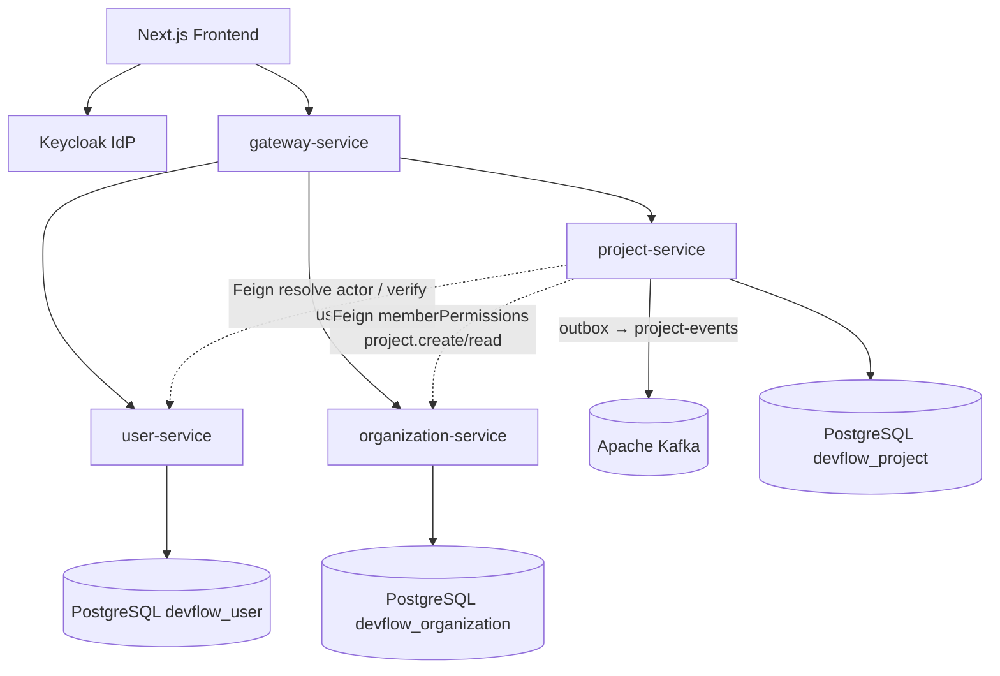

# Project Architecture — Phase 4

Phase 4 delivers project lifecycle, membership RBAC, settings, tags, favorites, activity, and reliable Kafka publishing via transactional outbox on top of Phase 2/3 identity and organization foundations.

---

## Service ownership

| Concern | Owner |
|---|---|
| Passwords, login, OIDC tokens | **Keycloak** |
| Application user (`externalIdentityId` ↔ `userId`) | **user-service** (`:8082`, `devflow_user`) |
| Org membership & org permission codes (`project.create`, `project.read`, `organization.read`) | **organization-service** (`:8083`, `devflow_organization`) |
| Projects, project members/roles, settings, tags, favorites, activity, outbox | **project-service** (`:8084`, `devflow_project`) |
| Edge JWT validation + routing `/api/projects/**` | **gateway-service** (`:8080`) |

Stable identity chain: Keycloak `sub` → user-service user id → project membership `user_id` / `created_by`.

---

## Boundaries



### Keycloak

- Issues JWT; project-service is a resource server (issuer/JWKS).
- Realm roles `ADMIN` / `SUPER_ADMIN` bypass project permission checks.
- Keycloak does **not** store project membership or project keys.

### user-service

- `CurrentUserResolver` maps JWT `sub` via Feign `GET /api/users/by-external-id/{sub}` (fallback `/api/users/me`).
- Member add verifies target user via `GET /api/users/{userId}`.

### organization-service

- `OrganizationClient.memberPermissions(orgId, userId)` supplies org permission codes.
- Used for:
  - **Create:** require `project.create`
  - **ORGANIZATION visibility read/list discovery:** `project.read` or `organization.read`
- Project RBAC itself is local to project-service (role → permission map).

---

## Feign org permission check

```
Create project:
  JWT → userId → OrganizationClient.memberPermissions(organizationId, userId)
               → must contain "project.create"

Read ORGANIZATION-visible project (non-member):
  same Feign call → "project.read" OR "organization.read"

List with organizationId filter:
  member projects OR (ORGANIZATION visibility AND org discovery perms)
```

Implementation: `ProjectAuthorizationService` + `OrganizationClient`. Feign 403/404/errors degrade to empty permission set (deny).

---

## Project RBAC matrix

Roles: `PROJECT_OWNER`, `PROJECT_ADMIN`, `PROJECT_MANAGER`, `PROJECT_DEVELOPER`, `PROJECT_VIEWER`, `PROJECT_GUEST`.

| Permission | OWNER | ADMIN | MANAGER | DEVELOPER | VIEWER | GUEST |
|---|---|---|---|---|---|---|
| `project.read` | ✓ | ✓ | ✓ | ✓ | ✓ | ✓ |
| `project.update` | ✓ | ✓ | ✓ | | | |
| `project.delete` | ✓ | | | | | |
| `project.archive` | ✓ | ✓ | | | | |
| `project.manage_members` | ✓ | ✓ | ✓ | | | |
| `project.manage_settings` | ✓ | ✓ | | | | |
| `project.manage_tags` | ✓ | ✓ | ✓ | | | |
| `project.view_activity` | ✓ | ✓ | ✓ | ✓ | ✓ | |
| `project.manage_project` | ✓ | ✓ | | | | |

**Ownership transfer:** allowed if actor has `project.manage_members` **or** is `PROJECT_OWNER`. New owner becomes `PROJECT_OWNER`; previous owners demoted to `PROJECT_ADMIN`. Cannot assign owner via member add/update APIs.

**Last owner protection:** cannot remove/demote/inactivate the last active `PROJECT_OWNER`.

---

## Visibility rules

| Visibility | Who can read |
|---|---|
| `PRIVATE` | Active project members with `project.read` (all roles include it) |
| `TEAM` | **Phase 4: same as PRIVATE** (members only; team-scoped sharing deferred) |
| `ORGANIZATION` | Members **or** org users with `project.read` / `organization.read` |

Platform admins always can read/act.

List without `organizationId` returns **member projects only** (avoids scanning all orgs via Feign).

---

## Immutable project key

**Decision:** `project_key` is set at create, stored uppercase, unique per organization, and **immutable** (`updatable = false`, no update DTO field).

**Rationale:**

- Stable short identifier for UI, URLs, and future issue keys (`API-123`)
- Avoids cascade renames across tasks/integrations
- Create JSON uses `"key"` (`@JsonProperty("key")` + `@JsonAlias({"projectKey","key"})`); responses expose `projectKey`

Slug is generated from name at create and is **not** regenerated on rename in Phase 4.

---

## Optimistic locking (`@Version`)

- `Project.version` and `ProjectSettings.version` use JPA `@Version`.
- Concurrent updates that stale-read can raise optimistic lock failures (mapped via global exception handling as conflict/internal depending on handler).
- Version is returned on project/settings responses for clients that want conditional update later.

---

## Transactional outbox pattern

Domain services never call `KafkaTemplate` directly.

```
@Transactional service method
  → mutate project tables
  → OutboxService.enqueue(PROJECT_*, aggregateId, payload)  // same TX
  → commit

OutboxPublisher (@Scheduled every ~2s)
  → load PENDING outbox rows (batch)
  → wrap EventEnvelope → KafkaTopics.PROJECT_EVENTS (key=aggregateId)
  → mark PUBLISHED or increment retry → FAILED after 10
```

Config: `devflow.outbox.poll-interval-ms`, `devflow.outbox.batch-size` (`SchedulingConfig` enables scheduling).

This yields **at-least-once** delivery with DB durability if the process crashes after commit but before publish.

---

## Domain lifecycle (projects)

```
POST create → ACTIVE (default) + OWNER membership + settings
  → PATCH update fields (not key)
  → POST archive | DELETE soft → ARCHIVED + PROJECT_ARCHIVED / PROJECT_DELETED
  → POST restore → ACTIVE + PROJECT_RESTORED
  → POST ownership/transfer
```

Activity rows are written for major mutations; Kafka events are enqueued in parallel via outbox.

---

## Related docs

- [API contract](../api/project-api-contract.md)
- [Database](../database/phase-4-project-database.md)
- [Events](../events/phase-4-events.md)
- [Frontend mapping](../frontend/project-feature-api-mapping.md)
- [Technology stack](../technology-stack/phase-4-project.md)
