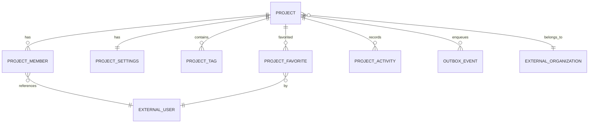

# Project Service — Implementation Plan (Prompt 5A Analysis)

**Phase:** 4 — Project Management  
**Document type:** Analysis & architecture plan (not an implementation changelog)  
**Source of truth:** Current repository inspection (frontend + backend)  
**Date context:** DevFlow Enterprise after Phases 1–3 (and existing Phase 4 project-service code)

> **Critical finding:** `backend/services/project-service` **already exists** and implements most of the Project domain (port `8084`, DB `devflow_project`, Flyway V1–V8, outbox → Kafka). This plan therefore distinguishes **what is already in the repo** from **gaps** (especially frontend mock ↔ backend contract) and recommends an integration-first sequence rather than a greenfield build.

---

## 1. Current architecture

```text
Next.js 15 (mock project.service.ts)
        │  (not yet wired to HTTP)
        ▼
Spring Cloud Gateway :8080
  JWT validation · CORS · rate limit · X-Correlation-Id
        │
        ├── auth-service :8081          (Keycloak JWT identity APIs)
        ├── user-service :8082          (application users, externalIdentityId = Keycloak sub)
        ├── organization-service :8083  (orgs, teams, org RBAC incl. project.*)
        └── project-service :8084       (projects, members, settings, tags, favorites, activity)
                │
                ├── PostgreSQL  devflow_project
                ├── Feign → user-service / organization-service
                └── Outbox → Kafka topic project-events
```

| Concern | Owner |
|---|---|
| Authentication / passwords / OIDC | Keycloak + auth-service |
| Application user profile | user-service |
| Organizations, teams, org RBAC | organization-service |
| Projects and project-scoped RBAC | **project-service** |
| Tasks / sprints / repos / deploys / AI | Future services (frontend placeholders exist) |

Gateway already routes `/api/projects/**` and `/api/v1/project/**` → `PROJECT_SERVICE_URL` (default `http://localhost:8084`). Docker Compose `apps` profile includes `project-service`.

---

## 2. Existing reusable patterns

| Pattern | Location | Reuse for Project |
|---|---|---|
| `ApiResponse` / `ApiError` | `common-library` | All REST responses |
| `PageResponse(items, page, pageSize, totalElements, totalPages)` | `common-library` | List/activity/members pagination |
| `BaseEntity` (UUID + timestamps) | `common-library` | JPA entities |
| `EventEnvelope` | `common-library` | Kafka payload shape |
| `KafkaTopics.PROJECT_EVENTS` | `common-library` | Topic name `project-events` |
| `KeycloakJwtAuthenticationConverter` | `common-library` | Resource-server JWT roles |
| `SecurityContextUtils` | `common-library` | JWT `sub` / roles |
| `CorrelationIdFilter` / `CorrelationIdHolder` | `common-library` auto-config | Logging + event correlation |
| `GlobalExceptionHandler` | `common-library` | 4xx/5xx envelope |
| `CurrentUserResolver` + Feign `UserClient` | org-service → copied in project-service | Actor UUID resolution |
| Feign `FeignClientConfig` (relay `Authorization`) | user/org/project | Service-to-service with user JWT |
| Org member permissions API | `GET /api/organizations/{orgId}/members/{userId}/permissions` | `project.create` / discovery |
| Outbox + `@Scheduled` publisher | project-service | Avoid DB/Kafka dual-write |
| SecurityConfig (JSON 401/403, method security) | auth/user/org/project | Consistent API security |
| Flyway per-service DB | each `*-service` | Isolated schema ownership |

**Controller pattern:** `@RestController` + `@RequestMapping` + `@PreAuthorize("isAuthenticated()")` + `ApiResponse.ok(...)`  
**Service pattern:** `@Service` + `@Transactional` + authz service + domain events via outbox  
**Repository pattern:** Spring Data JPA `JpaRepository` + Specifications for list/search  
**DTO pattern:** Java records + Bean Validation + Jackson `@JsonProperty("key")` for project key  
**Exception pattern:** Domain exceptions extending common `NotFoundException` / `ForbiddenException` / `ConflictException`  
**Mapper pattern:** Manual mapper classes (not MapStruct-heavy)

---

## 3. Frontend analysis

### 3.1 Data transport today

| Layer | Path | Reality |
|---|---|---|
| Types | `frontend/src/features/projects/types/project.types.ts` | Rich UI model |
| Service | `frontend/src/features/projects/services/project.service.ts` | **100% in-memory mock** (+ artificial delay) |
| Hooks | `frontend/src/features/projects/hooks/use-projects.ts` | TanStack Query over mock only |
| Store | `frontend/src/features/projects/store/project.store.ts` | Filters / sort / view mode (persisted) |
| Schemas | `frontend/src/features/projects/schemas/project.schema.ts` | Zod |
| Permissions | `frontend/src/lib/permissions/permissions.ts` | `project.read\|create\|update\|delete` |

**No HTTP client calls** are made for Projects today.

### 3.2 App routes

| Route | Page file | Primary UI |
|---|---|---|
| `/projects` | `app/(dashboard)/projects/page.tsx` | List (table/grid/compact) |
| `/projects/new` | `.../new/page.tsx` | Create form |
| `/projects/[projectId]` | `.../[projectId]/page.tsx` | Overview |
| `/projects/[projectId]/edit` | `.../edit/page.tsx` | Edit form |
| `/projects/[projectId]/settings` | `.../settings/page.tsx` | Settings + danger zone |
| `/projects/[projectId]/members` | `.../members/page.tsx` | Members table |
| `/projects/[projectId]/activity` | `.../activity/page.tsx` | Timeline |
| `/projects/[projectId]/analytics` | `.../analytics/page.tsx` | Charts (mock / future) |
| `/projects/[projectId]/repository` | `.../repository/page.tsx` | Repo card (future) |
| `/projects/[projectId]/environments` | `.../environments/page.tsx` | Deployments tab (future) |
| `/projects/[projectId]/tasks` | `.../tasks/page.tsx` | Tasks feature shell |
| `/projects/[projectId]/board` | `.../board/page.tsx` | Board (tasks) |
| `/projects/[projectId]/sprints` | `.../sprints/page.tsx` | Sprints feature |
| `/projects/[projectId]/backlog` | `.../backlog/page.tsx` | Backlog |
| `/projects/[projectId]/releases` | `.../releases/page.tsx` | Releases |
| `/projects/[projectId]/reports` | `.../reports/page.tsx` | Reports |
| `/projects/[projectId]/documents` | `.../documents/page.tsx` | Documents |

Sidebar: `frontend/src/components/layout/sidebar/nav-config.ts` → `/projects`.

### 3.3 Feature inventory (summary)

| Feature | Key components | Mock method | Loading / empty / error |
|---|---|---|---|
| List / grid / table / cards | `ProjectListView`, `ProjectTable`, `ProjectGrid`, `ProjectCard` | `list` | skeletons; `ProjectEmptyState` |
| Search / filters / sort | `ProjectSearch`, `ProjectFilters`, `ProjectSort` | client-side on mock | — |
| Create | `ProjectForm` | `create` | SubmitButton + AlertBanner |
| Edit | `ProjectForm` | `update` | Detail skeleton / FeatureEmptyState |
| Detail shell | `ProjectDetailShell`, `ProjectHeader`, `ProjectHero`, `ProjectSidebar`, `ProjectTabs` | `getById` | Detail skeleton |
| Overview | `ProjectOverview`, statistics, milestones, activity snippet | embedded in detail | empty variants |
| Settings | `ProjectSettingsForm` | `update` (not settings API) | AlertBanner |
| Members | `ProjectMembers` | embedded members | `no-members` |
| Favorites | `FavoriteProjectButton` | `toggleFavorite` | toast |
| Archive | `ProjectArchiveModal` | `archive` | ConfirmModal loading |
| Delete | `DeleteProjectModal` | `delete` (hard in mock) | key confirmation |
| Transfer | `TransferOwnershipModal` | `transferOwnership` | `memberId` + `TRANSFER` |
| Duplicate | `DuplicateProjectModal` | `duplicate` | — |
| Restore | — | `restore` exists in service | **no UI/hook** |
| Activity page | `ProjectTimeline` | embedded | `no-activity` |
| Tags | Tags on forms as `string[]` | create/update fields | no tag CRUD UI |
| Analytics / repo / envs | dedicated pages | embedded mock | out of project-service |
| Dashboard widgets | `ProjectOverviewWidget`, `RecentProjectsWidget`, `ProjectStatusChart` | **dashboard mock** | separate domain |
| Monitoring health widget | `ProjectHealthWidget` | **monitoring mock** | separate domain |

### 3.4 Frontend enums vs backend enums

| Concept | Frontend | Backend |
|---|---|---|
| Status | `planning`, `active`, **`paused`**, `completed`, `archived` | `PLANNING`, `ACTIVE`, **`ON_HOLD`**, `COMPLETED`, `ARCHIVED` |
| Health | `healthy`, `at_risk`, `critical`, `unknown` | `HEALTHY`, `AT_RISK`, `CRITICAL`, `UNKNOWN` |
| Visibility | `private`, **`internal`**, **`public`** | `PRIVATE`, **`ORGANIZATION`**, **`TEAM`** |
| Member roles | org `Role`: `owner\|admin\|manager\|developer\|viewer` | `PROJECT_OWNER` … `PROJECT_GUEST` |

### 3.5 Frontend fields without clean project-service equivalents

| Frontend field / aggregate | Notes |
|---|---|
| `progress`, `taskCount`, `completedTaskCount` | Task domain (future) |
| `ownerName`, `teamName`, `teamId` | Denormalized / org team — enrich client-side or later |
| `repositoryUrl`, `defaultBranch`, `technologyStack`, `language`, `color`, `logoUrl` | Not Phase 4 project core |
| `startDate`, `endDate`, `labels` | Not on create/update contract |
| `archived` boolean | Use `status=ARCHIVED` + `archivedAt` |
| Nested `statistics`, `milestones`, `analytics`, `repository`, `environments`, `upcomingReleases` | Future services |
| Member `capacity`, `name`, `email`, `avatarUrl` | Enrich via user-service |
| Fat `getById` embedding members+activity | Backend uses dedicated endpoints |

---

## 4. Frontend → API mapping

| Frontend action | Expected API | Backend status |
|---|---|---|
| List projects | `GET /api/projects?...` | **Exists** (needs page/size; enum mapping) |
| Open project | `GET /api/projects/{id}` | **Exists** (leaner than mock) |
| Create | `POST /api/projects` body `{ organizationId, name, description, key, icon?, visibility?, status? }` | **Exists** |
| Edit / settings (core) | `PATCH /api/projects/{id}` | **Exists** |
| Settings (flags/timezone/view) | `GET/PATCH /api/projects/{id}/settings` | **Exists** (UI not wired) |
| Archive | `POST /api/projects/{id}/archive` | **Exists** |
| Restore | `POST /api/projects/{id}/restore` | **Exists** (no UI) |
| Delete | `DELETE /api/projects/{id}` (soft archive) | **Exists** (mock hard-deletes) |
| Favorite toggle | `POST` / `DELETE` `.../favorite` | **Exists** |
| Favorites list | `GET /api/projects/favorites` | **Exists** |
| Members list/CRUD | `/api/projects/{id}/members` | **Exists** (UI uses embedded mock) |
| Transfer ownership | `POST .../ownership/transfer` `{ newOwnerUserId }` | **Exists** (UI uses `memberId`) |
| Tags CRUD | `/api/projects/{id}/tags` | **Exists** (UI uses string arrays) |
| Activity | `GET .../activity` | **Exists** |
| Summary | `GET .../summary` | **Exists** |
| Duplicate | — | **Missing** (UI exists) |
| Status-only / health-only PATCH | dedicated endpoints | **Partial** (via general PATCH; DTOs unused) |
| Import / Export | toast stubs | **N/A** |
| Analytics / repo / envs / tasks | other modules | **Out of scope** for project-service |

Detailed mapping also lives in `documentation/frontend/project-feature-api-mapping.md`.

---

## 5. Project domain

### 5.1 Boundary — Project Service owns

- Project lifecycle & metadata (`status`, `health`, `visibility`, `slug`, `projectKey`, `icon`)
- Project membership & project roles
- Project settings (1:1)
- Project tags
- Project favorites
- Project activity (local feed)
- Project events (outbox → Kafka)
- Project authorization matrix (`project.*` at project scope)

### 5.2 Project Service does **not** own

User identity, passwords, organizations, teams, authentication, tasks, issues, sprints, repositories, deployments, AI, notification delivery, audit storage (consumers later).

### 5.3 Entities (actual + planned)

| Entity | Purpose | Already in DB |
|---|---|---|
| `Project` | Aggregate root | Yes (`projects`) |
| `ProjectMember` | Membership + role | Yes |
| `ProjectSettings` | 1:1 settings | Yes |
| `ProjectTag` | Named colored tags | Yes |
| `ProjectFavorite` | Per-user favorite | Yes |
| `ProjectActivity` | Activity feed rows | Yes |
| `OutboxEvent` | Reliable Kafka publish | Yes (`outbox_events`) |

**No User/Organization tables** in project-service — only UUID references (`organizationId`, `createdBy`, `userId`).

### 5.4 Field model

**Project:** `id`, `organizationId`, `name`, `slug`, `description`, `projectKey`, `icon`, `status`, `health`, `visibility`, `createdBy`, `createdAt`, `updatedAt`, `archivedAt`, `version` (@Version)

**ProjectMember:** `id`, `projectId`, `userId`, `role`, `status`, `joinedAt`, `createdAt`, `updatedAt`  
Unique: `(projectId, userId)`

**ProjectSettings:** `id`, `projectId`, `defaultVisibility`, `allowMemberInvites`, `allowGuestAccess`, `timezone`, `defaultProjectView`, `createdAt`, `updatedAt`, `version`

**ProjectTag:** `id`, `projectId`, `name`, `color`, `createdAt` — Unique `(projectId, name)`

**ProjectFavorite:** `id`, `projectId`, `userId`, `createdAt` — Unique `(projectId, userId)`

**ProjectActivity:** `id`, `projectId`, `userId` (actor), `activityType`, `description`, `metadata` (JSONB), `createdAt`

### 5.5 Enums

| Enum | Values |
|---|---|
| `ProjectStatus` | `PLANNING`, `ACTIVE`, `ON_HOLD`, `COMPLETED`, `ARCHIVED` |
| `ProjectHealth` | `HEALTHY`, `AT_RISK`, `CRITICAL`, `UNKNOWN` |
| `ProjectVisibility` | `PRIVATE`, `ORGANIZATION`, `TEAM` |
| `ProjectMemberRole` | `PROJECT_OWNER`, `PROJECT_ADMIN`, `PROJECT_MANAGER`, `PROJECT_DEVELOPER`, `PROJECT_VIEWER`, `PROJECT_GUEST` |
| `ProjectMemberStatus` | `ACTIVE`, `INACTIVE` (REMOVED can be modeled as hard row delete or INACTIVE — current impl removes/deactivates via member APIs) |
| `ProjectView` (settings) | `LIST`, `BOARD`, `TIMELINE`, `OVERVIEW` |

**Decisions already reflected in code:**

- **Project key:** uppercase `A-Z0-9`, 2–10 chars, unique per organization, **immutable** after create; JSON property `"key"`.
- **Slug:** derived from name; unique `(organization_id, slug)`.
- **DELETE:** soft archive (`ARCHIVED` + `archivedAt`) + event `PROJECT_DELETED`.
- **TEAM visibility:** members-only until team association exists.
- **Health:** foundation value; not computed from tasks/deploys yet.

---

## 6. Database design

### 6.1 Tables (existing migrations V2–V8)

| Table | Notes |
|---|---|
| `projects` | PK UUID; unique `(organization_id, slug)`, `(organization_id, project_key)`; CHECK enums; `version` |
| `project_members` | unique `(project_id, user_id)`; indexes on project/user/role |
| `project_settings` | unique `project_id` |
| `project_tags` | unique `(project_id, name)`; color `#RRGGBB` |
| `project_favorites` | unique `(project_id, user_id)` |
| `project_activity` | indexes `(project_id)`, `(created_at)`; metadata JSONB |
| `outbox_events` | PENDING/PUBLISHED/FAILED; retry_count |

Indexes (minimum present): `organization_id`, `status`, `health`, `created_by`, membership/favorite/activity as above.

### 6.2 Soft delete / archive

Prefer `POST .../archive` and `POST .../restore`.  
`DELETE` performs soft archive (not physical wipe).

### 6.3 Optimistic locking

`@Version` on `Project` and `ProjectSettings` — concurrent PATCH may yield optimistic lock failures (map to 409 in handlers if not already).

### 6.4 External references

`organization_id`, `created_by`, `user_id` are **logical** UUIDs — **no cross-service FK**.

### 6.5 ER (logical)



See also `documentation/database/phase-4-project-database.md`.

---

## 7. Security model

### 7.1 Authentication

- Every protected endpoint: Bearer JWT (Keycloak) validated by Spring OAuth2 Resource Server.
- Actor identity: JWT `sub` → user-service (`externalIdentityId`) → application `userId` UUID.
- Never trust `userId` / `role` / `permissions` from request body as the actor.

### 7.2 Organization-level access (create / discovery)

- Synchronous Feign: org `GET .../members/{userId}/permissions`.
- Create requires org permission `project.create` (OWNER/ADMIN via org RBAC V4+V7; platform ADMIN/SUPER_ADMIN bypass).
- `ORGANIZATION` visibility discovery: org `project.read` or `organization.read`.

### 7.3 Project-level roles → permissions

| Role | Permissions (in-memory matrix) |
|---|---|
| `PROJECT_OWNER` | all `project.*` including delete |
| `PROJECT_ADMIN` | read, update, archive, manage_members/settings/tags, view_activity, manage_project |
| `PROJECT_MANAGER` | read, update, manage_members, manage_tags, view_activity |
| `PROJECT_DEVELOPER` | read, view_activity |
| `PROJECT_VIEWER` | read, view_activity |
| `PROJECT_GUEST` | read |

Permission codes: `project.read`, `project.create` (org), `project.update`, `project.delete`, `project.archive`, `project.manage_members`, `project.manage_settings`, `project.manage_tags`, `project.view_activity`, `project.manage_project`.

### 7.4 Ownership rules

- Create assigns creator as `PROJECT_OWNER`.
- Cannot remove the last owner.
- Ownership transfer is explicit (`POST .../ownership/transfer`); transactional demote/promote.

### 7.5 Visibility

| Visibility | Who can read |
|---|---|
| `PRIVATE` | Active project members with `project.read` |
| `ORGANIZATION` | Members **or** org users with `project.read` / `organization.read` |
| `TEAM` | Phase 4: treat as members-only |

Favorites: any authenticated user who can read the project (favorite is personal).  
Activity: requires `project.view_activity` (or platform admin).

---

## 8. Service communication

| Peer | Mechanism | Purpose |
|---|---|---|
| Gateway | HTTP ingress | JWT gate, CORS, rate limit, correlation |
| User Service | OpenFeign + Authorization relay | Resolve current user; verify member user exists |
| Organization Service | OpenFeign | Org permission codes for create/discovery |
| Auth Service | Indirect (JWT from Keycloak) | No direct Feign required for CRUD |
| Kafka | Outbox publisher | `project-events` for future consumers |
| Redis | Gateway rate limiting; project-service Redis client present | Not required for core project RBAC yet |

**Chosen org authz approach:** synchronous Feign (simplest correct boundary; no duplicated membership projection).  
**No distributed transactions** across Postgres instances.

---

## 9. Kafka event plan

**Topic:** `project-events`  
**Envelope:** `EventEnvelope` (`eventId`, `eventType`, `aggregateType`, `aggregateId`, `timestamp`, `source=project-service`, `version`, `correlationId`, `payload`)

| Event | Typical trigger | Publish status in repo |
|---|---|---|
| `PROJECT_CREATED` | create | Wired |
| `PROJECT_UPDATED` | PATCH project | Wired |
| `PROJECT_ARCHIVED` | archive | Wired |
| `PROJECT_RESTORED` | restore | Wired |
| `PROJECT_DELETED` | DELETE soft | Wired |
| `PROJECT_MEMBER_ADDED` / `_REMOVED` / `_ROLE_CHANGED` | members API | Wired |
| `PROJECT_OWNERSHIP_TRANSFERRED` | transfer | Wired |
| `PROJECT_SETTINGS_UPDATED` | settings PATCH | Wired |
| `PROJECT_TAG_*` | tags API | Wired |
| `PROJECT_FAVORITED` / `PROJECT_UNFAVORITED` | favorites | Wired |
| `PROJECT_STATUS_CHANGED` | status change | Enum exists; **not distinctly published** (folded into UPDATED) |
| `PROJECT_HEALTH_CHANGED` | health change | Enum exists; **not distinctly published** |

Reliability: transactional outbox (`outbox_events`) + scheduled publisher. At-least-once delivery; consumers must be idempotent.

---

## 10. Implementation sequence

Given code already exists, recommended order is **integration-first**:

1. **Freeze domain contract** — treat `project-api-contract.md` as frontend source of truth; document enum adapters.
2. **Frontend API client** — replace mock `project.service.ts` with gateway HTTP calls; map enums (`paused`↔`ON_HOLD`, `internal`↔`ORGANIZATION`); strip unsupported create fields or persist as future extensions.
3. **Wire list pagination** — frontend must send `page`/`size`; adapt `PageResponse.pageSize`.
4. **Split settings vs project PATCH** — settings form → settings API; tags → tags API; members → members API.
5. **Align transfer/delete UX** — `newOwnerUserId`; soft-delete messaging; optional restore UI.
6. **Optional backend hardenings**
   - Dedicated `PATCH .../status` and `PATCH .../health` using existing unused DTOs; publish `PROJECT_STATUS_CHANGED` / `PROJECT_HEALTH_CHANGED`.
   - Decide on **duplicate** API vs remove/hide frontend modal.
   - Map optimistic lock failures to 409.
   - Expand integration tests (Testcontainers).
7. **TEAM visibility** — associate teams when product requires it.
8. **Downstream consumers** — audit/notification/analytics in later phases.
9. **Do not** pull tasks/repo/analytics into project-service.

---

## 11. Risks

| Risk | Impact | Mitigation |
|---|---|---|
| Frontend/backend enum & field mismatch | Broken UI after cutover | Adapter layer + contract tests |
| Fat mock detail vs lean APIs | N+1 client calls or missing panels | Progressive enhancement; parallel fetches |
| Duplicate modal with no API | Dead feature | Implement or remove |
| Feign org authz latency / failure | Create/list fail closed | Timeouts, clear 403; optional cache later |
| Soft-delete vs mock hard-delete | User expectation mismatch | UX copy + restore |
| Platform ADMIN bypass vs org ADMIN | Broader access than org role alone | Document; keep consistent with org-service |
| Optimistic lock surprises | 409 on concurrent settings edit | Surface version to clients if needed |
| Over-scoping project-service | Boundary erosion | Reject task/repo fields in create |

---

## 12. Open questions

1. Should frontend `visibility: public` map to `ORGANIZATION` or be rejected?
2. Should `paused` be renamed in the UI to match `ON_HOLD`?
3. Is project **duplicate/clone** required for MVP, or can the modal be deferred?
4. Should delete require typing the project key (frontend today) when backend does not?
5. Should member list return denormalized user profile fields from project-service (via Feign enrich) or leave enrichment to the BFF/frontend?
6. When should `TEAM` visibility bind to organization teams?
7. Should status/health changes emit dedicated Kafka events in addition to `PROJECT_UPDATED`?
8. Dashboard widgets: continue on dashboard mock, or call `GET /api/projects` with small page size?

---

## 13. Proposed API list (canonical)

Aligned with existing backend + prompt; adjust frontend to this contract:

```
POST   /api/projects
GET    /api/projects
GET    /api/projects/{projectId}
PATCH  /api/projects/{projectId}
DELETE /api/projects/{projectId}
POST   /api/projects/{projectId}/archive
POST   /api/projects/{projectId}/restore
GET    /api/projects/{projectId}/summary
POST   /api/projects/{projectId}/ownership/transfer

GET|POST        /api/projects/{projectId}/members
PATCH|DELETE    /api/projects/{projectId}/members/{userId}

GET|PATCH       /api/projects/{projectId}/settings

GET|POST        /api/projects/{projectId}/tags
PATCH|DELETE    /api/projects/{projectId}/tags/{tagId}

POST|DELETE     /api/projects/{projectId}/favorite
GET             /api/projects/favorites

GET             /api/projects/{projectId}/activity

# Recommended additions (DTOs already present; endpoints not exposed)
PATCH           /api/projects/{projectId}/status
PATCH           /api/projects/{projectId}/health
```

---

## Related documents

- `documentation/api/project-api-contract.md`
- `documentation/frontend/project-feature-api-mapping.md`
- `documentation/architecture/project-architecture.md`
- `documentation/database/phase-4-project-database.md`
- `documentation/events/phase-4-events.md`
- `documentation/technology-stack/phase-4-project.md`
- `documentation/technology-stack/phase-4/5A-analysis.md`
