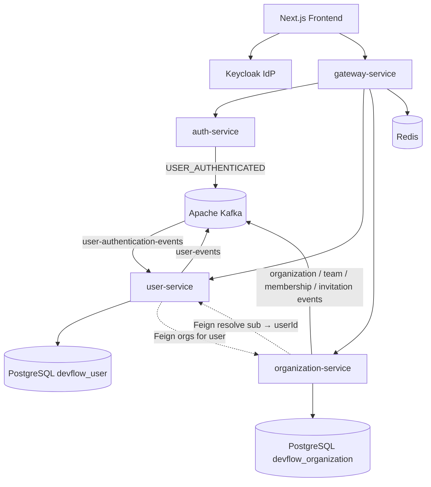

# User & Organization Architecture — Phase 3

Phase 3 delivers application identity profiles, multi-tenant organizations, teams, memberships, RBAC, and invitations on top of Phase 2 Keycloak authentication.

---

## Ownership split

| Concern | Owner |
|---|---|
| Passwords, login UI, SSO, OIDC tokens | **Keycloak** |
| Local user profile, preferences, `externalIdentityId` mapping | **user-service** (`services/user-service`, `:8082`, DB `devflow_user`) |
| Organizations, teams, memberships, roles/permissions, invitations | **organization-service** (`services/organization-service`, `:8083`, DB `devflow_organization`) |
| JWT validation at edge + coarse realm roles | **gateway-service** + each resource server |
| Auth session metadata / auth Kafka events | **auth-service** |

Stable cross-service identity key: Keycloak `sub` → `users.external_identity_id`. Email is never a primary key.

---

## Service relationships



---

## Keycloak relationship

1. User authenticates in Keycloak; frontend obtains JWT (`sub`, email, name claims, realm roles).
2. Gateway validates JWT (issuer/JWKS) and forwards `Authorization`.
3. **user-service** upserts local `users` row by `sub` on `GET /api/users/me` and on `USER_AUTHENTICATED`.
4. **organization-service** resolves the actor via Feign to user-service (`by-external-id`), then enforces **org RBAC** permissions from seeded `roles` / `permissions` / `role_permissions`.
5. Platform Keycloak roles `ADMIN` / `SUPER_ADMIN` bypass org permission checks for operations support.

Keycloak does **not** own org membership or business permissions.

---

## Domain lifecycles

### User

```
JWT / USER_AUTHENTICATED
        → upsert by externalIdentityId
        → ACTIVE profile
        → PATCH profile / preferences
        → optional DEACTIVATED / DELETED (soft)
```

### Organization

```
POST create → ACTIVE + OWNER membership
  → PATCH update / SUSPENDED
  → DELETE soft-archive → ARCHIVED
```

### Team

```
Create under org → update → hard delete (cascade team_memberships)
Members: TEAM_ADMIN | TEAM_MEMBER | TEAM_VIEWER
```

### Membership

```
Direct add OR invitation accept
  → ACTIVE membership + role_id
  → PATCH role / INACTIVE
  → DELETE hard-remove row
```

Unique business key: `(organization_id, user_id)`.

### Invitation

```
Create (raw token once, hash stored)
  → PENDING
  → accept (email match) → ACCEPTED + membership
  → revoke → REVOKED
  → expire → EXPIRED
```

### RBAC / permissions

Seeded org-scoped roles (`OWNER`, `ADMIN`, `MEMBER`, `GUEST`) map to permission codes such as `organization.read`, `team.manage_members`. Enforcement lives in `OrganizationAuthorizationService`. Project/task permission codes are seeded as definitions for later phases.

---

## Database ownership

| Database | Tables |
|---|---|
| `devflow_user` | `users` |
| `devflow_organization` | `organizations`, `teams`, `organization_memberships`, `team_memberships`, `roles`, `permissions`, `role_permissions`, `invitations` |

No shared DB writes across services. Cross-service references use UUIDs (`user_id`, `created_by`) without FK across databases.

Migrations: Flyway under each service `src/main/resources/db/migration/` (user `V2`, org `V2`–`V6`).

---

## Kafka integration

| Topic | Producer | Typical consumers (Phase 3+) |
|---|---|---|
| `user-authentication-events` | auth-service | **user-service** (upsert) |
| `user-events` | user-service | audit, notification, search (future) |
| `organization-events` | organization-service | audit, analytics (future) |
| `membership-events` | organization-service | auth cache, audit, notification (future) |
| `team-events` | organization-service | audit (future) |
| `invitation-events` | organization-service | notification, audit (future) |

Delivery is at-least-once. Consumers must be idempotent (see [../events/phase-3-events.md](../events/phase-3-events.md)).

---

## Security boundaries

| Boundary | Rule |
|---|---|
| Edge | Gateway JWT validation, CORS, rate limit (Redis) |
| Service | Stateless OAuth2 resource server; CSRF off for Bearer APIs |
| Identity PK | `externalIdentityId` / UUID — never email |
| Secrets | Invitation raw token once; only `token_hash` stored |
| Events | No passwords, JWTs, refresh tokens, or invitation raw tokens |
| Tenant authz | Org permission codes after membership load |
| Platform admin | Keycloak `ADMIN` / `SUPER_ADMIN` override |

---

## Request path (create org)

```
Browser → Gateway (JWT)
       → organization-service
           → CurrentUserResolver → user-service (sub → userId)
           → OrganizationService (persist org + OWNER membership)
           → OrganizationEventPublisher → Kafka
       ← ApiResponse<OrganizationResponse>
```

---

## Key code paths

| Area | Path |
|---|---|
| User upsert | `services/user-service/.../service/UserService.java` |
| Auth event consumer | `services/user-service/.../events/UserAuthenticatedListener.java` |
| Org authz | `services/organization-service/.../service/OrganizationAuthorizationService.java` |
| Invitation hashing | `services/organization-service/.../service/InvitationService.java` |
| Shared envelope | `common-library/.../api/ApiResponse.java`, `event/EventEnvelope.java` |
| Topics | `common-library/.../constant/KafkaTopics.java` |

---

## Related docs

- [../api/user-api-contract.md](../api/user-api-contract.md)
- [../api/organization-api-contract.md](../api/organization-api-contract.md)
- [../api/team-api-contract.md](../api/team-api-contract.md)
- [../api/membership-api-contract.md](../api/membership-api-contract.md)
- [../api/invitation-api-contract.md](../api/invitation-api-contract.md)
- [../database/phase-3-user-organization-database.md](../database/phase-3-user-organization-database.md)
- [../events/phase-3-events.md](../events/phase-3-events.md)
- [../technology-stack/phase-3-user-organization.md](../technology-stack/phase-3-user-organization.md)
