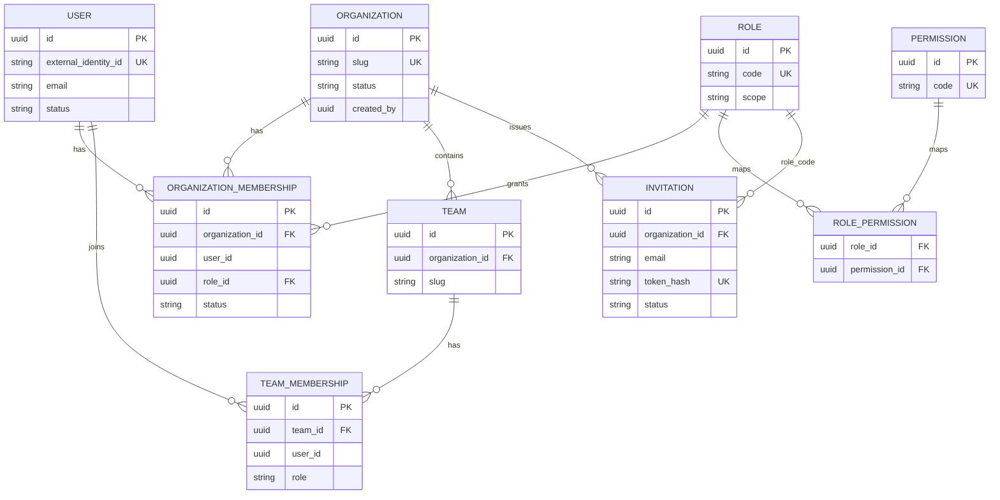

# Phase 3 Database — User & Organization

PostgreSQL system of record for Phase 3 domain data. Schemas are owned per service and migrated with Flyway.

| Service | Database | Migrations |
|---|---|---|
| user-service | `devflow_user` | `services/user-service/src/main/resources/db/migration/` (`V1`, `V2`) |
| organization-service | `devflow_organization` | `services/organization-service/src/main/resources/db/migration/` (`V1`–`V6`) |

Conventions: UUID primary keys, `timestamptz` audit columns, no cross-DB foreign keys.

---

## Entity relationship

Note: `USER` lives in `devflow_user`; all other tables above live in `devflow_organization`. `user_id` / `created_by` / `invited_by` are logical UUID references.

---

## Tables

### USER (`users`) — `devflow_user`

| Column | Type | Notes |
|---|---|---|
| `id` | UUID PK | Application user id |
| `external_identity_id` | VARCHAR(255) UNIQUE NOT NULL | Keycloak `sub` |
| `username` | VARCHAR(150) | |
| `email` | VARCHAR(320) | Not PK |
| `first_name` / `last_name` | VARCHAR(150) | |
| `display_name` | VARCHAR(255) | |
| `avatar_url` | VARCHAR(1024) | |
| `timezone` | VARCHAR(64) | |
| `locale` | VARCHAR(32) | |
| `status` | VARCHAR(32) | `ACTIVE\|INACTIVE\|SUSPENDED\|PENDING\|DELETED` |
| `theme` | VARCHAR(64) | Preference column |
| `notify_email` / `notify_in_app` | BOOLEAN | Preference columns |
| `created_at` / `updated_at` | TIMESTAMPTZ | |

**Indexes**

- `uq_users_external_identity_id` / `idx_users_external_identity_id`
- `idx_users_email`
- Partial unique `uq_users_email_active` on `email` where `status <> 'DELETED'`

**Soft delete:** `status = 'DELETED'` (row retained).

---

### ORGANIZATION (`organizations`)

| Column | Type | Notes |
|---|---|---|
| `id` | UUID PK | |
| `name` | VARCHAR(120) NOT NULL | |
| `slug` | VARCHAR(64) UNIQUE NOT NULL | Globally unique |
| `description` | VARCHAR(500) | |
| `logo_url` | VARCHAR(500) | |
| `status` | VARCHAR(32) | `ACTIVE\|SUSPENDED\|ARCHIVED` |
| `created_by` | UUID NOT NULL | Logical user id |
| `created_at` / `updated_at` | TIMESTAMPTZ | |

**Indexes:** `idx_organizations_slug`, `idx_organizations_status`, `idx_organizations_created_by`

**Soft delete:** `DELETE` API sets `status = 'ARCHIVED'`.

---

### TEAM (`teams`)

| Column | Type | Notes |
|---|---|---|
| `id` | UUID PK | |
| `organization_id` | UUID FK → organizations | |
| `name` | VARCHAR(120) | |
| `slug` | VARCHAR(64) | Unique per org |
| `description` | VARCHAR(500) | |
| `created_by` | UUID | |
| `created_at` / `updated_at` | TIMESTAMPTZ | |

**Indexes / constraints:** `uq_teams_org_slug (organization_id, slug)`, `idx_teams_organization_id`

**Delete:** Hard delete (API). Team memberships cascade via FK `ON DELETE CASCADE`.

---

### ORGANIZATION_MEMBERSHIP (`organization_memberships`)

| Column | Type | Notes |
|---|---|---|
| `id` | UUID PK | |
| `organization_id` | UUID FK | |
| `user_id` | UUID | Logical → users.id |
| `role_id` | UUID FK → roles | |
| `status` | VARCHAR(32) | `ACTIVE\|INACTIVE` |
| `joined_at` | TIMESTAMPTZ | |
| `created_at` / `updated_at` | TIMESTAMPTZ | |

**Constraints:** `uq_org_membership_org_user (organization_id, user_id)`

**Indexes:** org, user, role

**Delete:** Hard delete on remove; soft disable via `INACTIVE`.

---

### TEAM_MEMBERSHIP (`team_memberships`)

| Column | Type | Notes |
|---|---|---|
| `id` | UUID PK | |
| `team_id` | UUID FK → teams ON DELETE CASCADE | |
| `user_id` | UUID | |
| `role` | VARCHAR(32) | `TEAM_ADMIN\|TEAM_MEMBER\|TEAM_VIEWER` |
| `joined_at` | TIMESTAMPTZ | |
| `created_at` / `updated_at` | TIMESTAMPTZ | |

**Constraints:** `uq_team_membership_team_user (team_id, user_id)`

**Delete:** Hard delete.

---

### ROLE (`roles`)

| Column | Type | Notes |
|---|---|---|
| `id` | UUID PK | Stable seeded UUIDs |
| `code` | VARCHAR(64) UNIQUE | `OWNER`, `ADMIN`, `MEMBER`, `GUEST` |
| `name` | VARCHAR(120) | |
| `scope` | VARCHAR(32) | `ORGANIZATION` |
| `description` | VARCHAR(500) | |
| `created_at` / `updated_at` | TIMESTAMPTZ | |

Seeded in `V4__create_roles_permissions.sql`. No soft delete.

---

### PERMISSION (`permissions`)

| Column | Type | Notes |
|---|---|---|
| `id` | UUID PK | |
| `code` | VARCHAR(100) UNIQUE | e.g. `organization.read`, `team.create` |
| `name` / `description` | VARCHAR | |
| `created_at` / `updated_at` | TIMESTAMPTZ | |

Includes project/task permission definitions for later phases.

---

### ROLE_PERMISSION (`role_permissions`)

| Column | Type | Notes |
|---|---|---|
| `role_id` | UUID FK | Composite PK |
| `permission_id` | UUID FK | Composite PK |

**Index:** `idx_role_permissions_permission_id`

No timestamps (junction only).

---

### INVITATION (`invitations`)

| Column | Type | Notes |
|---|---|---|
| `id` | UUID PK | |
| `organization_id` | UUID FK | |
| `email` | VARCHAR(320) | Invitee |
| `role_code` | VARCHAR(64) | Role granted on accept |
| `token_hash` | VARCHAR(128) UNIQUE | SHA-256 of raw token |
| `status` | VARCHAR(32) | `PENDING\|ACCEPTED\|EXPIRED\|REVOKED` |
| `expires_at` | TIMESTAMPTZ | |
| `invited_by` | UUID | |
| `created_at` / `updated_at` | TIMESTAMPTZ | |
| `accepted_at` | TIMESTAMPTZ NULL | |

**Indexes:** organization, email, status, `(organization_id, status)`

**Lifecycle delete:** Status transitions — raw token never stored.

---

## Soft delete summary

| Table | Pattern |
|---|---|
| `users` | Soft → `DELETED` |
| `organizations` | Soft → `ARCHIVED` |
| `organization_memberships` | Hard delete; or `INACTIVE` |
| `teams` / `team_memberships` | Hard delete |
| `roles` / `permissions` / `role_permissions` | Immutable seed data |
| `invitations` | Status machine |

---

## Idempotency helpers

- Upsert users by unique `external_identity_id`
- Membership uniqueness `(organization_id, user_id)` and `(team_id, user_id)`
- Invitation lookup by unique `token_hash`
