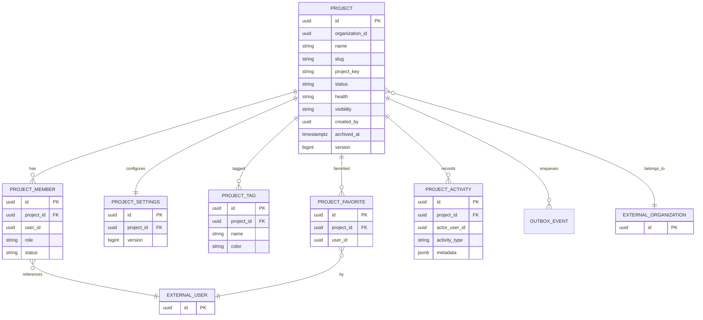

# Phase 4 Database — Project Management (Prompt 5B)

PostgreSQL system of record for the project domain. Schema owned exclusively by **project-service**.

| Service | Database | Migrations path |
|---|---|---|
| project-service | `devflow_project` | `services/project-service/src/main/resources/db/migration/` |

**Ownership:** Project Service owns these tables. `organization_id`, `created_by`, and member `user_id` are logical UUID references to Organization/User services — **no cross-database foreign keys**.

---

## Why PostgreSQL

- ACID local transactions for project + owner membership + settings + outbox
- Composite unique constraints (`organization_id` + `project_key` / `slug`)
- JSONB for activity metadata
- Aligns with Phases 1–3 Flyway + Spring Data JPA stack

---

## Migrations

| Version | File | Purpose |
|---|---|---|
| V1 | `V1__initial.sql` | Phase 1 `schema_foundation` marker |
| V2 | `V2__create_projects.sql` | `projects` + uniques + CHECKs + base indexes |
| V3 | `V3__create_project_members.sql` | `project_members` |
| V4 | `V4__create_project_settings.sql` | `project_settings` (1:1) |
| V5 | `V5__create_project_tags.sql` | `project_tags` |
| V6 | `V6__create_project_favorites.sql` | `project_favorites` |
| V7 | `V7__create_project_activity.sql` | `project_activity` + JSONB metadata |
| V8 | `V8__create_outbox_events.sql` | Transactional outbox |
| V9 | `V9__project_query_indexes_and_member_removed.sql` | `REMOVED` member status + composite query indexes |
| V10 | `V10__outbox_correlation_and_last_error.sql` | Outbox `correlation_id`, `last_error` |

---

## ER diagram

---

## Tables and columns

### `projects`

| Column | Type | Notes |
|---|---|---|
| id | UUID PK | Hibernate UUID |
| organization_id | UUID NOT NULL | External org ref |
| name | VARCHAR(160) NOT NULL | |
| slug | VARCHAR(180) NOT NULL | URL-safe |
| description | VARCHAR(2000) | |
| project_key | VARCHAR(10) NOT NULL | Immutable; `^[A-Z0-9]{2,10}$` |
| icon | VARCHAR(64) | |
| status | VARCHAR(32) NOT NULL | PLANNING, ACTIVE, ON_HOLD, COMPLETED, ARCHIVED |
| health | VARCHAR(32) NOT NULL | HEALTHY, AT_RISK, CRITICAL, UNKNOWN |
| visibility | VARCHAR(32) NOT NULL | PRIVATE, ORGANIZATION, TEAM |
| created_by | UUID NOT NULL | External user ref |
| created_at / updated_at | TIMESTAMPTZ NOT NULL | UTC |
| archived_at | TIMESTAMPTZ | Set on archive/soft-delete |
| version | BIGINT NOT NULL | Optimistic lock |

**Constraints:** `uq_projects_org_slug`, `uq_projects_org_key`, status/health/visibility/key CHECKs.

### `project_members`

| Column | Type | Notes |
|---|---|---|
| id | UUID PK | |
| project_id | UUID FK → projects | |
| user_id | UUID | External user |
| role | VARCHAR(32) | PROJECT_OWNER … PROJECT_GUEST |
| status | VARCHAR(32) | ACTIVE, INACTIVE, **REMOVED** |
| joined_at | TIMESTAMPTZ | |
| created_at / updated_at | TIMESTAMPTZ | |

**Unique:** `(project_id, user_id)`. Soft-remove sets `REMOVED` (re-add reactivates).

### `project_settings`

One-to-one with project (`uq_project_settings_project_id`). Fields: `default_visibility`, `allow_member_invites`, `allow_guest_access`, `timezone`, `default_project_view` (LIST|BOARD|TIMELINE|OVERVIEW), `version`.

### `project_tags`

Unique `(project_id, name)`. `color` CHECK `^#[0-9A-Fa-f]{6}$`.

### `project_favorites`

Unique `(project_id, user_id)`.

### `project_activity`

`actor_user_id`, `activity_type`, `description`, optional `metadata` JSONB. No sensitive tokens.

### `outbox_events`

Reliable Kafka publish: `aggregate_type`, `aggregate_id`, `event_type`, `payload`, `status` (PENDING|PUBLISHED|FAILED), `retry_count`, timestamps.

---

## Indexes (query-driven)

| Index | Table | Supports |
|---|---|---|
| `idx_projects_organization_id` | projects | Org-scoped lists |
| `idx_projects_status` / `health` / `visibility` | projects | Filters |
| `idx_projects_created_by` | projects | Creator queries |
| `idx_projects_name` | projects | Search assist |
| `idx_projects_org_status` (V9) | projects | `organizationId` + `status` list |
| `idx_projects_org_key` (V9) | projects | Key lookup path |
| Unique `(organization_id, slug/key)` | projects | Uniqueness + lookups |
| `idx_project_members_project_id` / `user_id` / `role` | members | Authz / lists |
| `idx_project_members_project_status` (V9) | members | Active membership |
| `idx_project_tags_project_id` | tags | Tag list / filter |
| `idx_project_favorites_user_id` / `project_id` | favorites | Favorites API |
| `idx_project_activity_project_id` / `created_at` / `type` | activity | Feed |
| `idx_project_activity_project_created` (V9) | activity | Paginated newest-first |

---

## Archiving strategy

| Action | Behavior |
|---|---|
| `POST .../archive` | `status=ARCHIVED`, set `archived_at` |
| `DELETE .../{id}` | Soft archive + `PROJECT_DELETED` event (row retained) |
| `POST .../restore` | `status=ACTIVE`, clear `archived_at` |
| Physical delete | **Not** used for normal lifecycle |

Archived projects reject metadata/status PATCH until restored (`ProjectDomainRules`).

---

## Concurrency strategy

- `@Version` on `Project` and `ProjectSettings`
- Concurrent updates may raise optimistic lock failures (HTTP 409 via persistence exception handling when mapped)
- Membership uniqueness enforced at DB level

---

## Query patterns

1. **List:** filter `organization_id`, `status`, `health`, `visibility`, ILIKE search on name/slug/key/description, tag subquery, favorite subquery; page/sort.
2. **Detail:** by id + memberCount / tags / favorite flag (service-layer aggregation).
3. **Authz:** active membership by `(project_id, user_id)` status=ACTIVE.
4. **Activity:** by `project_id` ordered by `created_at` DESC.

---

## Entities (JPA)

| Entity | Package |
|---|---|
| `Project` | `com.devflow.project.entity` |
| `ProjectMember` | same |
| `ProjectSettings` | same |
| `ProjectTag` | same |
| `ProjectFavorite` | same |
| `ProjectActivity` | same (`actorUserId` maps to `actor_user_id`) |
| `OutboxEvent` | same |

Domain rules: `com.devflow.project.domain.ProjectDomainRules`.

---

## Related docs

- `documentation/architecture/project-service-implementation-plan.md`
- `documentation/technology-stack/phase-4/5B-database.md`
- `documentation/api/project-api-contract.md`
