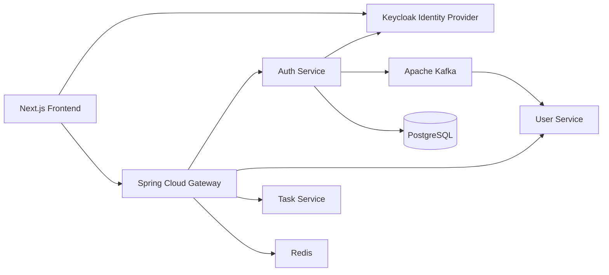

# Phase 2 — Authentication & Identity Foundation

Production-style authentication for DevFlow Enterprise using **Keycloak as the sole Identity Provider**, Spring Security OAuth2 Resource Servers, JWT validation at the gateway and each microservice, and Kafka authentication events.

**No custom password authentication.** Passwords are never stored in application PostgreSQL.

---

## Architecture



### Ownership split

| Concern | Owner |
|---|---|
| Passwords, login UI, SSO sessions, OAuth2/OIDC, token issue/refresh | **Keycloak** |
| Application profile, org/team membership, business permissions | **Application services** (User Service+) |
| JWT validation, coarse role checks, auth metadata APIs | **Auth Service / each resource server** |

Stable identity key: Keycloak `sub` → application `externalIdentityId`.

---

## Authentication vs authorization vs business permissions

| Layer | Question | Phase 2 |
|---|---|---|
| Authentication | Who are you? | Keycloak JWT (`sub`, claims) |
| Authorization | What realm role do you have? | `realm_access.roles` → `@PreAuthorize` / `hasRole` |
| Business authorization | Can you edit *this* project? | Deferred (foundation only via `UserProfileService` boundary) |

---

## CSRF strategy

DevFlow APIs authenticate with **Bearer access tokens**, not traditional cookie session auth.

- CSRF protection is primarily needed when browsers automatically attach session cookies on cross-site requests.
- Resource servers and the gateway therefore **disable CSRF** for API routes.
- If a future BFF introduces cookie-based sessions, CSRF (or SameSite + double-submit) must be re-enabled for those cookie-authenticated endpoints.

This is a deliberate trade-off, not a blind disablement.

---

## Security headers

| Header / control | Approach |
|---|---|
| CORS | Centralized at gateway; explicit origins (`http://localhost:3000` dev); **never** `*` with credentials |
| CSP | Documented for frontend; API responses are JSON (CSP enforced in Next.js) |
| `X-Content-Type-Options` | `nosniff` via Spring Security headers |
| Frame protection | `X-Frame-Options: DENY` on auth-service |
| Referrer policy | `strict-origin-when-cross-origin` |

---

## Database note (Phase 2)

PostgreSQL for auth-service holds only infrastructure/schema markers required by Flyway/JPA bootstrap.

- **No password tables**
- **No credential tables**
- Keycloak’s own DB (or Keycloak datastore) owns identity credentials

---

## Kafka topic: `user-authentication-events`

| | |
|---|---|
| Producer | `auth-service` |
| Future consumers | `user-service`, `audit-service`, `analytics-service`, `notification-service` |

Prepared event types (payload never includes tokens/secrets):

- `USER_AUTHENTICATED`
- `USER_LOGOUT`
- `AUTHENTICATION_FAILED` (reserved)
- `ROLE_CHANGED` (reserved)
- `USER_DISABLED` (reserved)

Example:

```json
{
  "eventId": "...",
  "eventType": "USER_AUTHENTICATED",
  "userId": "8f3c...",
  "timestamp": "...",
  "source": "auth-service",
  "correlationId": "..."
}
```

---

## Logout model

| Mechanism | Effect |
|---|---|
| Frontend logout | Clears local tokens |
| Keycloak session logout | Ends IdP SSO via logout URL from `/api/auth/logout` |
| Access token expiry | JWT rejected after `exp` |
| Refresh invalidation | Via Keycloak; access JWTs are not denylisted in Phase 2 |

---

## Auth Service API surface

| Method | Path | Auth |
|---|---|---|
| GET | `/api/auth/health` | Public |
| GET | `/api/v1/auth/health` | Public |
| GET | `/api/auth/status` | Public |
| GET | `/api/auth/me` | JWT |
| POST | `/api/auth/logout` | JWT |
| GET | `/api/auth/admin/ping` | JWT + ADMIN/SUPER_ADMIN |

Frontend contract: [../api/auth-api-contract.md](../api/auth-api-contract.md)

---

# Technologies

## 1. Keycloak

### Purpose
Enterprise Identity Provider for authentication, sessions, OIDC, and token issuance.

### Why DevFlow uses it
Avoids custom password stores; provides SSO, PKCE, refresh, logout, and Admin API for lifecycle ops.

### Where it is integrated
- `infrastructure/keycloak/realm-devflow.json`
- Docker Compose `keycloak` service (port 8180)
- Auth-service `KeycloakService` / `KeycloakProperties`
- JWT issuer for gateway + all resource servers

### Code-level integration
- Realm `devflow`, clients `devflow-web` (public PKCE) and `devflow-gateway` (confidential)
- Roles: `SUPER_ADMIN`, `ADMIN`, `MANAGER`, `DEVELOPER`, `QA`, `VIEWER`, `GUEST`
- Admin API boundary behind `KEYCLOAK_ADMIN_API_ENABLED` (default `false`)

### Configuration
```
KEYCLOAK_URL=http://localhost:8180
KEYCLOAK_REALM=devflow
KEYCLOAK_ISSUER_URI=http://localhost:8180/realms/devflow
KEYCLOAK_WEB_CLIENT_ID=devflow-web
KEYCLOAK_ADMIN_CLIENT_ID=devflow-gateway
KEYCLOAK_ADMIN_CLIENT_SECRET=...
```

### Request/data flow
Browser → Keycloak login → tokens → Browser → Gateway/APIs with Bearer JWT → services validate via JWKS.

### Security considerations
Admin credentials and client secrets stay server-side only. Demo users are local-only.

### Testing approach
Realm import docs + mocked JWT unit tests (no real secrets in CI).

### Future scaling considerations
Externalize Keycloak HA, theme branding, brute-force protection, and federated IdPs.

---

## 2. OAuth 2.0

### Purpose
Delegated authorization protocol for obtaining access tokens.

### Why DevFlow uses it
Standard, interoperable token acquisition without sharing passwords with APIs.

### Where it is integrated
Keycloak clients; frontend Authorization Code flow; optional client-credentials for Admin API.

### Code-level integration
Frontend PKCE against `devflow-web`; `KeycloakService.fetchAdminAccessToken()` for confidential client.

### Configuration
Client settings in realm export; env vars for issuer/client IDs.

### Request/data flow
`authorize` → `code` → `token` → Bearer usage on APIs.

### Security considerations
Public client uses PKCE; confidential secret never in browser.

### Testing approach
Contract tests with stubbed JWTs; document flows in auth API contract.

### Future scaling considerations
Token exchange / service accounts for service-to-service calls.

---

## 3. OpenID Connect

### Purpose
Identity layer on OAuth 2.0 (`openid` scope, ID tokens, UserInfo/claims).

### Why DevFlow uses it
Provides `sub`, email, name claims for application identity without a custom login UI.

### Where it is integrated
Keycloak OIDC endpoints; JWT claim mapping in `SecurityContextService`.

### Code-level integration
Claims: `sub`, `preferred_username`, `email`, `given_name`, `family_name`, `email_verified`, `realm_access.roles`.

### Configuration
Scopes `openid profile email` in frontend authorize request.

### Request/data flow
ID token for logout hint; access token for API auth.

### Security considerations
Validate issuer/signature/exp on access tokens at each service.

### Testing approach
`SecurityContextServiceTest` maps claim set to `CurrentUser`.

### Future scaling considerations
Optional UserInfo endpoint if claims grow beyond JWT size limits.

---

## 4. JWT

### Purpose
Self-contained access tokens validated via JWKS.

### Why DevFlow uses it
Stateless API auth across gateway and microservices.

### Where it is integrated
Spring OAuth2 Resource Server in gateway + auth-service (+ other services).

### Code-level integration
`JwtAuthenticationConverter` + `JwtRoleConverter` map roles to `ROLE_*` authorities.

### Configuration
```
spring.security.oauth2.resourceserver.jwt.issuer-uri
spring.security.oauth2.resourceserver.jwt.jwk-set-uri
```

### Request/data flow
`Authorization: Bearer <jwt>` → signature/iss/exp validation → SecurityContext.

### Security considerations
Do not log tokens. Prefer short TTL. No Phase 2 denylist (rely on expiry + Keycloak logout).

### Testing approach
Invalid/missing token → 401; role mismatch → 403; converter unit tests.

### Future scaling considerations
Audience (`aud`) hardening per client; optional opaque token introspection for high-risk ops.

---

## 5. Spring Security

### Purpose
HTTP security filter chain, method security, headers, exception handling.

### Why DevFlow uses it
Consistent enterprise security model across Boot services.

### Where it is integrated
`auth-service` `SecurityConfig`; gateway reactive `SecurityConfig`.

### Code-level integration
Public matchers only for health/status/docs; everything else authenticated; JSON 401/403 handlers.

### Configuration
`@EnableMethodSecurity`; session `STATELESS`.

### Request/data flow
Filter chain → JWT filter → authorization → controller.

### Security considerations
CSRF disabled for Bearer APIs (documented). Headers enabled for content-type/frame/referrer.

### Testing approach
`@WebMvcTest` + `spring-security-test` JWT post-processors.

### Future scaling considerations
Shared security starter module if filter chains proliferate.

---

## 6. Spring OAuth2 Resource Server

### Purpose
Validate JWTs issued by Keycloak as a resource server.

### Why DevFlow uses it
First-class Boot support for issuer/JWKS validation without custom crypto.

### Where it is integrated
`spring-boot-starter-oauth2-resource-server` on auth-service and gateway (and other services).

### Code-level integration
`.oauth2ResourceServer(oauth -> oauth.jwt(...))` with custom converter.

### Configuration
Issuer URI + JWK set URI from env.

### Request/data flow
Each service independently validates — gateway passage is **not** trust.

### Security considerations
Never `permitAll()` on business endpoints; never disable JWT validation.

### Testing approach
Mock `JwtDecoder` in slice tests; integration against Keycloak locally.

### Future scaling considerations
Multi-issuer support if federating additional IdPs.

---

## 7. Spring Method Security

### Purpose
Declarative role/authority checks on service methods and controllers.

### Why DevFlow uses it
Reusable authorization without hard-coding role checks in every controller body.

### Where it is integrated
`@EnableMethodSecurity`; example `@PreAuthorize("hasAnyRole('ADMIN','SUPER_ADMIN')")` on `/admin/ping`.

### Code-level integration
Helpers via Spring expressions: `hasRole`, `hasAnyRole`, `hasAuthority`.

### Configuration
Enabled in `SecurityConfig`.

### Request/data flow
Authenticated principal → method interceptor → allow/deny.

### Security considerations
Coarse realm roles only in Phase 2; resource-scoped checks come later.

### Testing approach
Developer JWT → 403 on admin ping; Admin JWT → 200.

### Future scaling considerations
Custom `PermissionEvaluator` for project/org business permissions.

---

## 8. Redis

### Purpose
Short-lived infrastructure state — primarily gateway rate limiting.

### Why DevFlow uses it
Shared counters for edge throttling without coupling to JWT validation.

### Where it is integrated
Gateway `RequestRateLimiter` + `RedisRateLimiter`; auth-service Redis client available for temporary security state.

### Code-level integration
`RateLimiterConfig`, IP `KeyResolver` extension point.

### Configuration
`REDIS_HOST`, `REDIS_PORT`, replenish/burst env vars.

### Request/data flow
Request → gateway rate limiter → Redis INCR/TTL → allow/429.

### Security considerations
Never store passwords or long-lived access tokens in Redis for this phase.

### Testing approach
Local compose with Redis; unit-test resolver beans.

### Future scaling considerations
Per-user / per-route limiters for auth endpoints under abuse.

---

## 9. Apache Kafka

### Purpose
Async authentication domain events.

### Why DevFlow uses it
Decouples auth-service from future user provisioning, audit, analytics.

### Where it is integrated
Topic `user-authentication-events`; `AuthEventPublisher`; topic scripts + `KafkaConfig` `NewTopic`.

### Code-level integration
```java
authEventPublisher.publish(AuthEventType.USER_AUTHENTICATED, userId);
```

### Configuration
`KAFKA_BOOTSTRAP_SERVERS`

### Request/data flow
`/me` or `/logout` → publish JSON event → future consumers.

### Security considerations
Never publish passwords, access/refresh tokens, or secrets.

### Testing approach
`AuthEventPublisherTest` asserts payload hygiene.

### Future scaling considerations
Schema registry; consumer groups per domain service; DLQ for audit.

---

## 10. Spring Cloud Gateway

### Purpose
Edge routing, CORS, JWT gate, correlation ID, rate-limit foundation.

### Why DevFlow uses it
Single public entry for Next.js; forwards `Authorization` to services.

### Where it is integrated
`gateway-service` routes `/api/auth/**` → auth-service; Redis rate limiter; CORS config.

### Code-level integration
`SecurityConfig` (reactive), `CorsConfig`, `CorrelationIdGatewayFilter`, `RateLimiterConfig`.

### Configuration
`AUTH_SERVICE_URL`, `CORS_ALLOWED_ORIGINS`, Keycloak issuer/JWKS.

### Request/data flow
Browser → Gateway (CORS + rate limit + JWT) → Auth Service (JWT again).

### Security considerations
Business authorization stays in owning services — gateway does not duplicate it.

### Testing approach
Route/health smoke tests; CORS origin allowlist docs.

### Future scaling considerations
mTLS to internal services; WAF/bot rules in front of gateway.

---

## 11. OpenAPI / Swagger

### Purpose
Document public vs authenticated auth endpoints and Bearer security scheme.

### Why DevFlow uses it
Clear frontend/backend contract and interactive exploration.

### Where it is integrated
`OpenApiConfig` + springdoc on auth-service (`/swagger-ui.html`).

### Code-level integration
`@SecurityRequirement(name = "bearerAuth")` on protected operations; empty security on health.

### Configuration
`springdoc.swagger-ui.path=/swagger-ui.html`

### Request/data flow
Generate OpenAPI from annotations → Swagger UI Authorize with JWT.

### Security considerations
Do not expose admin client secrets in examples; keep demo tokens out of git.

### Testing approach
Contract markdown + OpenAPI annotations reviewed in PR.

### Future scaling considerations
Aggregate gateway OpenAPI or per-service docs portal.

---

## 12. Docker

### Purpose
Local runtime for Keycloak, Postgres, Redis, Kafka, and optional app containers.

### Why DevFlow uses it
Reproducible Phase 2 stack without installing each dependency natively.

### Where it is integrated
`infrastructure/docker/docker-compose.yml` — infra always; `--profile apps` for `auth-service` + `gateway-service`.

### Code-level integration
Service Dockerfiles; `application-docker.yml` networking (`keycloak:8080`, `kafka:29092`).

### Configuration
`.env` from `.env.example`.

### Request/data flow
Compose network: frontend host → published ports → containers.

### Security considerations
Default secrets are local placeholders — change before any shared environment.

### Testing approach
Compose up + curl health/status/me with Keycloak token.

### Future scaling considerations
Kubernetes manifests; separate Keycloak DB volume backups.

---

## 13. Java 21

### Purpose
Language runtime for auth-service, gateway, common-library.

### Why DevFlow uses it
LTS + modern APIs; aligns with Phase 1 foundation.

### Where it is integrated
All backend modules (`maven.compiler.release=21`).

### Code-level integration
Records for DTOs (`CurrentUser`, responses); clear security services.

### Configuration
Parent POM `java.version=21`.

### Request/data flow
N/A (runtime).

### Security considerations
Keep dependencies updated via parent BOM.

### Testing approach
JUnit 5 on JDK 21 CI image.

### Future scaling considerations
Virtual threads for Keycloak Admin API fan-out if needed.

---

## 14. Spring Boot 3

### Purpose
Application framework for auth-service and gateway security stack.

### Why DevFlow uses it
Native OAuth2 Resource Server, Actuator, Kafka, Redis, OpenAPI starters.

### Where it is integrated
`AuthServiceApplication`, gateway Boot app, common auto-config.

### Code-level integration
Controller → Service → Keycloak/Kafka boundaries; Flyway for schema markers only.

### Configuration
Profiles `local` / `docker`; env-driven Keycloak/Redis/Kafka.

### Request/data flow
Boot embedded Tomcat (auth) / Netty (gateway) → security → business handlers.

### Security considerations
Actuator details `when_authorized`; health remains public where intended.

### Testing approach
`@WebMvcTest`, unit tests, optional `@SpringBootTest` with Testcontainers later.

### Future scaling considerations
Split auth Admin API into a restricted internal network profile.

---

## Logging rules (security)

Include: `correlationId`, `eventType`, `userId` (when known), timestamp, service, result.  
**Never log:** `Authorization` header, JWT, password, refresh token, client secret.

---

## Local run (Phase 2)

```bash
cd backend
cp .env.example .env
docker compose -f infrastructure/docker/docker-compose.yml up -d
mvn clean install
mvn -pl services/auth-service,gateway-service -am spring-boot:run
# or after package:
docker compose -f infrastructure/docker/docker-compose.yml --profile apps up -d
```

Obtain a token from Keycloak (PKCE or password grant for local tooling only), then:

```bash
curl -H "Authorization: Bearer $TOKEN" http://localhost:8080/api/auth/me
```

---

## Out of scope (later phases)

- Full User Service profile persistence
- Organization/project permission model
- Production Keycloak HA / custom themes
- JWT revocation denylist
- Frontend Keycloak adapter implementation (contract only in this phase)
